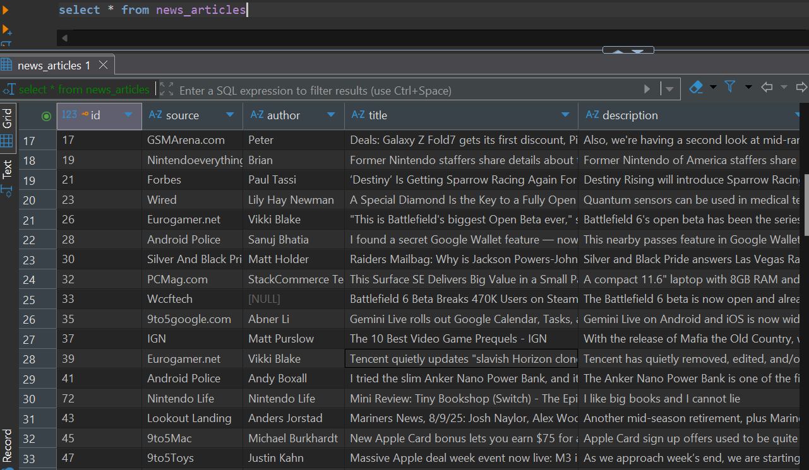
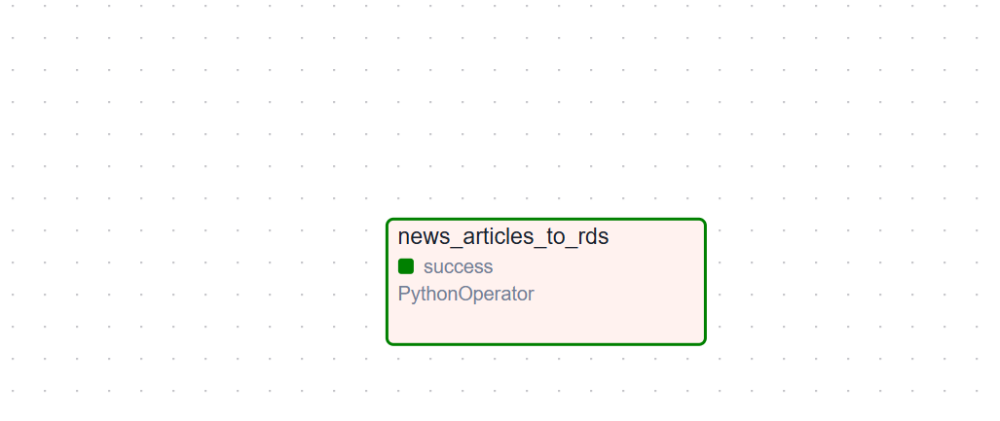

# Tech News ETL Pipeline with Airflow, RDS, and Redshift

## Project Overview
This project is an **ETL (Extract, Transform, Load)** pipeline that collects **technology news** from the [NewsAPI](https://newsapi.org/), stores it in an **AWS RDS PostgreSQL** database, and then replicates it into **AWS Redshift** for analytics.

The orchestration is done with Apache Airflow, and Airbyte is used to move data reliably from RDS into Redshift.

---

## ⚙️ **Architecture**

**Airflow orchestrates the pipeline:**

- Fetch news headlines (API → Pandas DataFrame)

- Load data into RDS PostgreSQL

**Airbyte handles data replication:**

- Syncs data from RDS → Redshift

- Redshift is used as the data warehouse for analytics.

##  Tech Stack
- **Python** — Data extraction & transformation
- **Pandas** — Data cleaning and manipulation
- **Requests** — API data fetching
- **PostgreSQL (AWS RDS)** — Staging database

- **Amazon Redshift** — Data warehouse for analytics
- **Terraform** — Infrastructure as Code (IaC)
- **Apache Airflow** — Workflow orchestration

---

## Data Workflow

**Extract**

Airflow task calls the News API and fetches technology headlines.

**Transform**
Data is normalized into a Pandas DataFrame.

**Load (into RDS)**

Data is inserted into a PostgreSQL table (news_articles).

**Replicate (RDS → Redshift)**

Airbyte syncs the data from RDS PostgreSQL into Redshift.

**Analyze**

Final data sits in Redshift, ready for querying and analytics.

